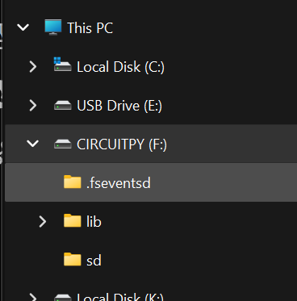

# CIRCUIT_PY_DRIVE

***CIRCUIT_PY_DRIVE*** is the drive letter for the USB file system that appears when you plug in your controller, typically with a CIRCUITPY label

When CircuitPython is installed on a controller[^1], it updates the bootloader and causes the controller to act like a USB flash drive when connected to a Windows PC.  

[^1]: This is true for most boards, however some older controllers (like an ESP32)