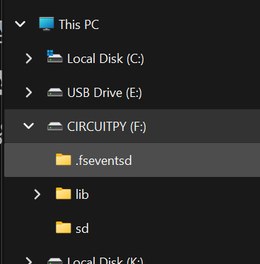

# The CIRCUITPY Drive

Understanding the [CircuitPython](https://circuitpython.org/) CIRCUITPY drive is vital to working with this system. 

## Where is my CIRCUITPY drive?

The CIRCUITPY drive will appear as a [USB Flash Drive](https://en.wikipedia.org/wiki/USB_flash_drive) with the label ```CIRCUITPY``` when you connect your controller to a Windows PC with a USB cable[^1]. 



In the above example, drive **F:** is the CIRCUITPY drive.  The actual drive letter may be different in your system, but you can find it in Windows File Explorer.

## References to the CIRCUITPY drive

In this documentation, references to the [CIRCUITPY drive](CIRCUITPY_DRIVE.mdx) will link back to this page.

| example | description |--- |
| [***CIRCUITPY***](CIRCUITPY_DRIVE.mdx)__:\code.py__  | the file ___F:\code.py___   |
| [***CIRCUITPY***](CIRCUITPY_DRIVE.mdx)__:\lib__ | the __lib__ directory on __F:__ |

## more details

When CircuitPython is installed on a controller[^1], it updates the bootloader and causes the controller to act like a USB flash drive when connected to a Windows PC.  

[^1]: Note that this will not work until CircuitPython has been successfully been installed on a controller with [UF2](https://github.com/microsoft/uf2) support. Not all controllers supported by CircuitPython support UF2 - it works on ESP32-S2 or an ESP32-S3, but not the original ESP32