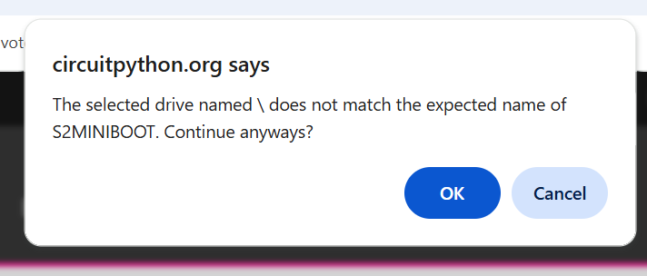

# LOLIN (Wemos) S2 Mini

https://circuitpython.org/board/lolin_s2_mini/

The following boards have been tested and are compatible :
  -  https://www.amazon.com/dp/B0BXX6R15D
  -  https://www.amazon.com/dp/B0B291LZ99

## Initial setup
Connect a Windows PC to your controller via USB
- If a new drive labeled CIRCUITPY appears, it's already set up for UF2/CircuitPython
- If nothing happens, you need to do the initial install
  - note that "nothing happens" is a very good description for an S2 Mini without a 
UF2 bootloader.  There is no power light, and the board will not appear as a 
USB device.  People sometimes assume the board is dead and return them...

### Install CircuitPython on fresh controller (no UF2 bootloader)
  WARNING : this will erase currently everything on your controller

This should be a simple (although slightly tedious) install, IF you follow the 
directions carefully AND the online Installer hasn't changed.

  - goto https://circuitpython.org/board/lolin_s2_mini/
  - There should be an install section on the right: 
  - click "OPEN INSTALLER" 

    
  - select "Full CircuitPython 9.2.4 Install"
  - click "Next"
  -  
  - Click "Connect"
  - You most likely will NOT see your controller listed at first 
  - 
  - While connected via USB, press and hold the BOOT button, double click the RESET button, then release the BOOT button.This should restart the controller in update mode, and your controller should appear in the list 
  - 
  - Select your controller ( ESP32-S2 (COM6) for this example) and press "Connect"
  - 
  - select "Continue"
  - flash will be erased
  - 
  - If you don't see a new drive appear with a label  like S2MINIBOOT or CIRCUITPY, you probably need to reboot your controller. Double press RESET, disconnect/reconnect USB.  You should now see a new drive appear in file explorer
    

  - Click "Select S2MINIBOOTDRIVE" and select the new drive (F: for this example)
  - 
  - Click "Edit Files"
  - If you see this, click OK : 
  - The drive should now be labeled CIRCUITPY 
  
   

  - 
  - Select the CIRCUITPY drive
  - 
  - Put in your WiFi info
  - 
    
  - more details under the "Install, Repair, or Update UF2 Bootloader" section at https://circuitpython.org/board/lolin_s2_mini/
