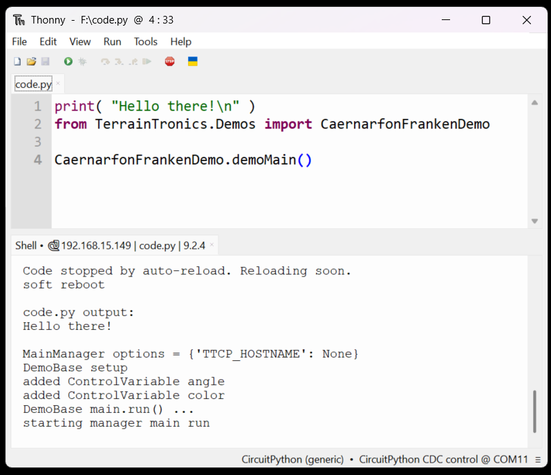

# Getting Started

## Complete Initial Setup on your controller

- Install CircuitPython and the TerrainTronics bundle on your controller.
  - TODO: more detail / better instructions for this
  - for now look at details for your controller under [Supported Controllers](../Controllers/SupportedControllers.MD) and then [Initial Controler Setup](InitialControllerSetup.MD)
  - The rest of the instructions below assume that this has been done, and you have a working [CIRCUITPY drive](../CIRCUITPY_DRIVE.MD)

## Setup a supported editor

WARNING: Not all editors work well for CircuitPython[^editors]. Starting with Mu or Thonny is ***highly recommended*** unless you are already familiar with Python, USB serial device access, and ESP32 development or VSCode.

- [Mu](https://codewith.mu/en/)
  - Python editor for beginners with [CircuitPython support](https://codewith.mu/en/tutorials/1.2/adafruit)
- [Thonny](https://thonny.org/) 
  - more flexible than Mu, less complicated than VSCode
  - under Tools / Options / Interpreter select ```CircuitPython (generic)```
- [Visual Studio Code](https://code.visualstudio.com/) 
  - more complicated IDE, works well if you're already familiar with VSCode
  - useful extensions
    -  [CircuitPython v2](https://marketplace.visualstudio.com/items?itemName=wmerkens.vscode-circuitpython-v2)
    - [Serial Monitor](https://marketplace.visualstudio.com/items?itemName=ms-vscode.vscode-serial-monitor)


## Setup a USB serial console interface

You need the ability to see console text output (error messages, print statements, ...) from your controller.  The editors listed above (with proper configuration / extensions) already have this built in.  Otherwise, you need a terminal program that can connect to a USB serial device. 

## code.py

[***CIRCUITPY***](../CIRCUITPY_DRIVE.MD)__:/code.py__ is a very special file.  It is loaded and run each time your controller starts (or restarts)[^safeMode]

## Uploading your code

A controller running CircuitPython with a [CIRCUITPY drive](../CIRCUITPY_DRIVE.MD), simply saving your changes to [***CIRCUITPY***](../CIRCUITPY_DRIVE.MD)__:\code.py__ (or any other file on your [CIRCUITPY drive](../CIRCUITPY_DRIVE.MD)) is all you need to do[^editors].  There is no separate "firmware upload" step required.  For example, here's what you'd see saving 

```python
print( "Hello there!\n" )
from TerrainTronics.Demos import CaernarfonFrankenDemo

CaernarfonFrankenDemo.demoMain()
```

to [***CIRCUITPY***](../CIRCUITPY_DRIVE.MD)__:\code.py__ with Thonny :




## Playing with Demos

There are files for demos In [***CIRCUITPY_DRIVE***](../CIRCUITPY_DRIVE.MD)__:\libs\TerrainTronics\Demos_

[***CIRCUITPY_DRIVE***](../CIRCUITPY_DRIVE.MD)__:\code.py__ is a file that gets automatically run when the controller boots

There are a number of ways to run a demo. For example, to run  **CaernarfonLavaLights** (at [***CIRCUITPY_DRIVE***](../CIRCUITPY_DRIVE.MD)__:\libs\TerrainTronics\Demos\CaernarfonLavaLights.py__ ),  [***CIRCUITPY_DRIVE***](../CIRCUITPY_DRIVE.MD)__:\code.py__ could look like
```
from TerrainTronics.Demos import CaernarfonLavaLights
CaernarfonLavaLights.demoMain()
```
or you could copy the contents of [***CIRCUITPY_DRIVE***](../CIRCUITPY_DRIVE.MD)__:\libs\TerrainTronics\Demos\CaernarfonLavaLights.py__ into [***CIRCUITPY_DRIVE***](../CIRCUITPY_DRIVE.MD)__:\code.py__ and add ```demoMain()```
```
# copied contents from CaernarfonLavaLights.py ...

demoMain()
``` 
at the end

## Notes

[^safeMode]:  Technically it isn't ___always___ run - if the code in your controller crashes, it can go into "safe mode" which causes it to skip loading code.py on the next reset.running on

[^editors]: Not all editors save files "properly" when using a USB device.  Files can get partially written and/or take a while before the changes are actually written to the drive. See [Adafruit's Recommended Editors](https://learn.adafruit.com/welcome-to-circuitpython/recommended-editors) for more details. 